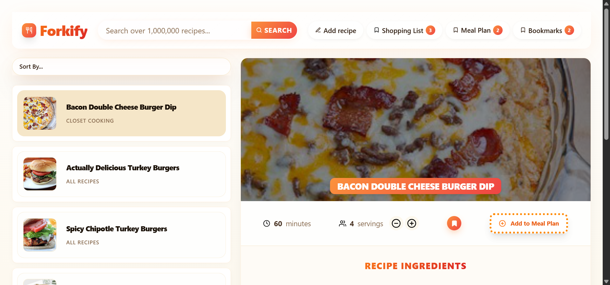
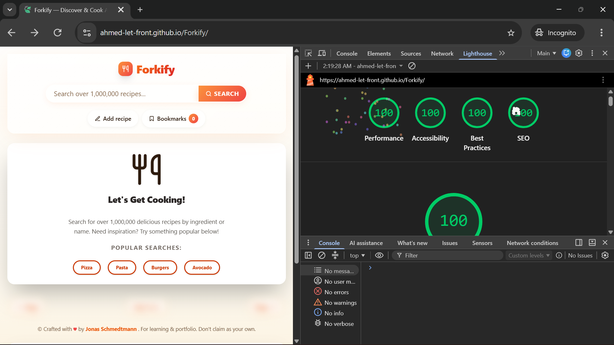

# 🍴 Forkify v2 // Advanced Enterprise MVC Recipe Engine

## 💡 Original Concept & Acknowledgments

The core UI layout and application concept of Forkify are inspired by the educational resources of **Jonas Schmedtmann**. This version represents a complete structural rewrite, migrating the logic to an advanced, highly modular enterprise architecture built on modern web standards.

---

An advanced, production-grade refactoring of the Forkify application. This architecture completely overhauls the standard blueprint, transforming it into a strict, highly optimized, and memory-safe **Model-View-Controller (MVC)** and **Object-Oriented Programming (OOP)** ecosystem built using modern development tools.

## 


- [**Live Demo:**](https://ahmed-let-front.github.io/Forkify/)

---

## 🚀 Performance & Production Metrics

 
- **Google Lighthouse Score:** 💯 **400/400** (Perfect 100/100 across Performance, Accessibility, Best Practices, and SEO). 

---

## 🏗️ Architectural Overhaul & MVC Design

Unlike standard spaghetti code, this codebase has been heavily re-engineered to enforce the **Model-View-Controller (MVC)** architectural pattern. However, the standard blueprint was intentionally modified to accommodate a rigid adherence to clean code principles.


### 1. The Single Responsibility Principle (SRP)

At the core of this architectural shift is an extreme focus on the **S in SOLID**. The traditional MVC flow was restructured to break down monolithic operations into highly granular, isolated functions and private methods. Every method is strictly scoped to perform exactly one task—for example, DOM markup generation is completely decoupled from UI updating logic. This micro-level separation ensures that every piece of the codebase has exactly one reason to change, maximizing maintainability.

### 2. Selective JSDoc Type Annotations & Inline Documentation

To ensure maximum code maintainability, clear type contracts, and developer experience without overloading the codebase with redundant noise, **JSDoc annotations are strategically integrated** throughout key modules:

- **Complex Data Contracts (`@typedef`):** Annotating structured objects such as recipe models, state shapes, and ingredient structures to enable IDE autocompletion and static type checking.
- **Public API & Module Boundaries (`@param`, `@returns`):** Documenting export methods within the Model and View layers to clearly define inputs, expected return values, and async Promises.
- **Publisher-Subscriber Handlers (`@callback`):** Clearly documenting controller handlers passed as subscribers to view event listeners, guaranteeing strict interface adherence across layers.

### 3. The Publisher-Subscriber Pattern

To keep the `Controller` (the brain) and the `View` (the UI) completely decoupled, the application utilizes the **Publisher-Subscriber Pattern**.

- The **View** acts as the _Publisher_, listening for DOM events (clicks, form submissions).
- The **Controller** acts as the _Subscriber_, passing handler functions into the View without the View ever knowing the underlying business logic.

### 4. State Management & Data Integrity

The `Model` acts as the single source of truth (`State`). All incoming API data, user bookmarks, and custom recipes are parsed, formatted, and stored in a central, immutable state object before being served to the Views.

---

## ✨ Core Features & Logic Pipelines

### 1. Dynamic Recipe Search (Query Engine)

An asynchronous search pipeline that fetches thousands of recipes via REST API. The results are strictly paginated to ensure optimal memory allocation, rendering only a fixed number of DOM nodes at a time to prevent UI thread blocking.

### 2. Intelligent Bookmarking System

Users can bookmark recipes. The active state is managed via pass-by-reference mutations in the state array.

- **UI State Reflection & Persistent Selection:** The DOM instantly reflects active bookmarks using precise `aria-attributes` and CSS class toggling without full re-renders. When a recipe is bookmarked, the UI immediately updates to show an explicitly "selected" (filled) bookmark icon.
- **LocalStorage Sync:** The bookmark array is safely serialized to JSON and persisted in `localStorage`. This ensures that all saved recipes, along with their active selected icon states on the UI, remain fully intact and available across page reloads and future sessions.

### 3. Custom Recipe Uploads & Search Integration

A robust form pipeline allowing users to upload their own recipes.

- Features custom data validation and sanitization.
- Automatically structures raw string inputs (quantities, units, descriptions) into structured Object arrays before pushing them to the cloud via POST requests.
- **Seamless Search Integration:** Any custom recipe uploaded by the user is instantly indexed within the application's runtime state. When querying the API for ingredients, the user's personal uploaded recipes will automatically integrate and appear alongside the global search results.

---

## 🗺️ Visualizing the System Runtime Flow


The system map follows a continuous, optimized cycle:

1. **User Event (Search/Upload/Bookmark)** ➡️
2. **Controller Interception (Async API Calls & Data Parsing)** ➡️
3. **State Mutation (Updating the Model)** ➡️
4. **View Rendering (DOM Diffing & UI Updates)** ➡️
5. **Storage Sync (`localStorage` persistence)**.

---

## 🛠️ Tech Stack & Implementation Details

- **Core Language:** JavaScript (ES6+ Strict OOP & MVC Paradigm with JSDoc Type Annotations)
- **Data Fetching:** Native `fetch` API with highly structured `async/await` error handling.
- **Styles & Layout:** **Tailwind CSS v4.x** (Utilizing advanced CSS-first configuration, fluid utility styling, and custom `@layer components`).
- **Bundler & Build Tool:** Vite (Optimized production asset splitting and rapid HMR).

---

## 📦 Project Initialization & Local Setup

This project was built from scratch using a modern frontend workflow. Here is how the environment was initialized and structured:

### 1. Environment Initialization

The project environment was scaffolded using **Vite** and configured with **Tailwind CSS v4**:

````bash
# 1. Initialize the project with Vite
npm create vite@latest . -- --template vanilla

# 2. Install dependencies (Tailwind v4 and GitHub Pages for deployment)
npm install tailwindcss @tailwindcss/vite gh-pages

# 3. Start the local development server
npm run dev
## 📦 Project Initialization & Local Setup

This project was built from scratch using a modern frontend workflow. Here is how the environment was initialized and structured:

### 1. Environment Initialization

The project environment was scaffolded using **Vite** and configured with **Tailwind CSS v4**:

```bash
# 1. Initialize the project with Vite
npm create vite@latest . -- --template vanilla

# 2. Install dependencies (Tailwind v4 and GitHub Pages for deployment)
npm install tailwindcss @tailwindcss/vite gh-pages

# 3. Start the local development server
npm run dev
````

---

## 2. Version Control & Git Setup

To track the architecture development and link it to GitHub:

```bash
# Initialize local Git repository
git init

# Stage all architectural files
git add .

# Commit the initial clean setup
git commit -m "feat: initial safe MVC architecture setup with Tailwind v4"

# Link to your remote GitHub repository
git remote add origin []

# Push to the main branch
git branch -M main
git push -u origin main
```

---

## 3. Production Deployment Pipeline

The application uses the gh-pages engine to build and bundle static assets dynamically:

```bash
# Deploy the production build to GitHub Pages
npm run deploy
```

---

## ⚙️ Vite Build Configuration (vite.config.js)

To guarantee a high-performance build process and achieve a perfect Google Lighthouse score, a custom Vite configuration was designed to handle chunk splitting and asset hashing:

```javascript
import { defineConfig } from 'vite';
import tailwindcss from '@tailwindcss/vite';

export default defineConfig({
  plugins: [tailwindcss()],
  base: '/Forkify/',
  build: {
    sourcemap: false, // Disabled in production to compress build size and shield source code
    rollupOptions: {
      output: {
        // Strict file caching busting using hashes
        assetFileNames: 'assets/[name]-[hash][extname]',
        chunkFileNames: 'assets/[name]-[hash].js',
        entryFileNames: 'assets/[name]-[hash].js',

        // Advanced Manual Chunk Splitting
        manualChunks(id) {
          if (id.includes('node_modules')) {
            return 'vendor'; // Segregates heavy external tools from core app logic
          }
        },
      },
    },
  },
});
```

## Thanks by **UIO** ❤️
